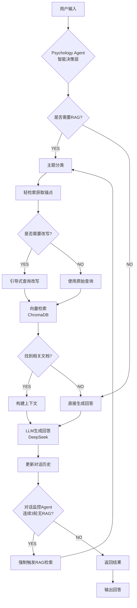

<p align="center">
  <h1 align="center">💝 PsyChat</h1>
  <p align="center">
    <strong>基于 RAG 技术的智能心理咨询伴侣</strong>
  </p>
  <p align="center">
    运用理情行为疗法（REBT），为用户提供专业的心理健康支持
  </p>
</p>

<p align="center">
  
  
  
  
  
</p>

---

## ✨ 项目简介

**PsyChat** 是一个基于检索增强生成（RAG）技术的心理咨询 AI 助手。它结合了大语言模型的对话能力和心理咨询知识库的专业性，运用理情行为疗法（REBT）理论，帮助用户识别和调整非理性信念，缓解负面情绪。

### 🌟 核心特性

- 🧠 **智能 Agent 决策**：自动判断是否需要检索知识库，动态调整回答策略
- 📚 **专业心理知识库**：涵盖情绪管理、人际关系、职场压力、家庭婚恋等多个主题
- 🔄 **对话持续监控**：连续多轮无 RAG 时自动触发强制检索，保证回答质量
- 💡 **查询智能改写**：基于上下文优化检索查询，提升检索准确性
- 🎨 **现代 Web 界面**：简洁美观的对话界面，支持移动端自适应

## 🏗️ 系统架构



## 🛠️ 技术栈

| 组件 | 技术 | 说明 |
|------|------|------|
| **LLM** | DeepSeek Chat | 对话生成和推理 |
| **Embedding** | 阿里云百炼 text-embedding-v4 | 文本向量化 |
| **Vector DB** | ChromaDB | 高效向量存储和检索 |
| **Web 框架** | FastAPI + Uvicorn | 高性能异步 Web 服务 |
| **理论基础** | 理情行为疗法 (REBT) | 心理咨询核心方法论 |

## 📦 快速开始

### 1. 克隆项目

```bash
git clone https://github.com/your-username/PsyChat.git
cd PsyChat
```

### 2. 安装依赖

```bash
pip install -r requirements.txt
```

### 3. 配置环境变量

复制 `env.example` 为 `.env` 并填入你的 API 密钥：

```bash
cp env.example .env
```

编辑 `.env` 文件：

```env
# DeepSeek API (https://platform.deepseek.com/)
DEEPSEEK_API_KEY=your_deepseek_api_key_here

# 阿里云百炼 API (https://bailian.console.aliyun.com/)
ALIBABA_API_KEY=your_alibaba_api_key_here
```

### 4. 构建知识库

首次运行需要构建向量知识库：

```bash
python main.py --rebuild
```

### 5. 启动服务

```bash
# 启动 Web 界面（默认）
python main.py

# 或使用命令行模式
python main.py --cli
```

访问 http://localhost:8000 即可开始对话！

## 📁 项目结构

```
PsyChat/
├── main.py                 # 程序入口
├── requirements.txt        # 依赖列表
├── env.example            # 环境变量模板
├── src/
│   ├── config.py          # 配置文件
│   ├── agent/
│   │   └── psychology_agent.py  # 心理咨询 Agent
│   ├── core/
│   │   ├── rag_system.py       # RAG 系统核心
│   │   └── vector_store.py     # 向量存储
│   ├── data/
│   │   └── processor.py        # 数据处理
│   └── web/
│       └── interface.py        # Web 界面
├── resources/
│   ├── knowledge/         # 心理学知识库文档
│   └── prompts/           # 系统提示词
├── storage/
│   └── chroma_db/         # 向量数据库（自动生成）
└── docs/
    └── architecture.md    # 架构文档
```

## 📚 数据集来源

本项目的知识库基于 [PsyDTCorpus](https://modelscope.cn/datasets/YIRONGCHEN/PsyDTCorpus) 数据集构建。

原始数据集经过以下预处理和增强：
- 按心理学主题（情绪、人际、职场、家庭、婚恋等）重新分类整理
- 优化问答对格式，适配 RAG 检索
- 添加主题标签，支持精准主题过滤

## 🔧 命令行参数

| 参数 | 说明 |
|------|------|
| `--rebuild` | 重新构建知识库 |
| `--info` | 显示知识库信息 |
| `--cli` | 使用命令行交互模式 |

## 📝 配置说明

主要配置项（`src/config.py`）：

| 配置项 | 默认值 | 说明 |
|--------|--------|------|
| `CHUNK_SIZE` | 400 | 文本分块大小 |
| `CHUNK_OVERLAP` | 50 | 分块重叠大小 |
| `TOP_K_RESULTS` | 6 | 检索返回文档数 |
| `SIMILARITY_THRESHOLD` | 0.15 | 相似度阈值 |
| `MAX_NO_RAG_ROUNDS` | 3 | 触发强制 RAG 的轮数 |

## ⚠️ 免责声明

本项目仅供学习和研究使用。AI 咨询师的回复**不构成专业医疗建议**，如有严重心理健康问题，请及时寻求专业心理咨询师或医生的帮助。

## 📄 License

本项目采用 [MIT License](LICENSE) 开源协议。

## 🤝 贡献

欢迎提交 Issue 和 Pull Request！

---

<p align="center">
  Made with 💝 by <a href="https://github.com/your-username">wink-wink-wink555</a>
</p>

