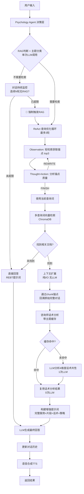

<p align="center">
  <h1 align="center">💝 PsyChat</h1>
  <p align="center">
    <strong>基于 RAG 技术的智能心理咨询伴侣</strong>
  </p>
  <p align="center">
    基于范例模仿真实心理咨询师的话语模式，为用户提供专业的心理健康支持
  </p>
</p>

<p align="center">
  
  
  
  
  
</p>

---

## ✨ 项目简介

**PsyChat** 是一个基于检索增强生成（RAG）技术的心理咨询 AI 助手。其核心目标是最大程度地**蒸馏真实心理咨询师的说话方式**——不只是复用知识库中的内容，而是主动分析、学习专业咨询师在共情、提问、引导节奏上的共性模式，并将其迁移到每一轮对话中。

系统运用理情行为疗法（REBT）理论框架，结合多阶段 Agent 工作流，帮助用户识别和调整非理性信念，缓解负面情绪。

### 🌟 核心特性

- 🧠 **ReAct 查询优化**：轻检索获取锚点 → 分析匹配度 → 改写或直接检索，动态提升检索准确性
- 📖 **完整对话上下文扩展**：突破 chunk 片段限制，回溯完整咨询案例，让模型看到咨询师的完整工作节奏
- 🎯 **咨询师话术分析**：主动提炼参考案例中咨询师的共情方式、提问策略、引导节奏和语言特点，作为显式约束指导回答
- 💡 **交互策略规划**：回答前先判断对话所处阶段，规划下一步引导方向，而非被动应答
- 🔄 **对话持续监控**：连续多轮无 RAG 时自动触发强制检索，保持专业性
- 🎤 **语音合成播放**：基于阿里云百炼 TTS，将回答转换为温暖的语音

---

## 🏗️ 系统架构

### 整体工作流


```mermaid
graph TD
    A[用户输入] --> B[Psychology Agent 决策层]

    B --> C{RAG判断 + 主题分类\n单次LLM调用}

    C -->|不需要检索| D[对话持续监控\n连续N轮无RAG?]
    D -->|未超限| E[直接回答\nREBT提示词]
    D -->|已超限| F[🚨 强制触发RAG]

    C -->|需要检索| G[ReAct 查询优化循环\n最多3轮]
    F --> G

    G --> G1[Observation: 轻检索获取锚点 top3]
    G1 --> G2[Thought+Action: 分析锚点质量]
    G2 -->|FINISH| H[使用当前查询词]
    G2 -->|REWRITE| G1

    H --> I[多查询词向量检索\nChromaDB]

    I --> J{找到相关文档?}
    J -->|未找到| E
    J -->|找到| K[上下文扩展\n纯I/O 无LLM]

    K --> K1[通过chunk锚点\n回溯原始完整对话]
    K1 --> L[咨询师话术分析\n带主题缓存]

    L --> L1{缓存命中?}
    L1 -->|命中| M[复用话术分析结果\n0次LLM]
    L1 -->|未命中| L2[LLM分析4维度话术共性\n1次LLM]
    L2 --> M

    M --> N[构建增强提示词\n完整案例+片段+话术+策略]
    E --> O
    N --> O[LLM生成最终回答]

    O --> P[更新对话历史]
    P --> Q[语音合成TTS]
    Q --> R[返回结果]
```

### 各阶段详解

#### 阶段一：RAG 判断 + 主题分类（1 次 LLM）

`PsychologyAgent.judge_rag_and_classify()` 在单次调用中完成两件事：

1. **是否检索**：区分简单问候/闲聊（不检索）与实质性心理问题（检索）
2. **主题分类**：从 12 个预设主题中识别 1-3 个相关主题，用于后续向量检索过滤

```
12 个主题：情绪 / 人际 / 婚恋 / 家庭 / 性心理 / 成长 / 治疗 / 社会 / 职场 / 自我 / 行为 / 心理学知识
```

#### 阶段二：ReAct 查询优化（最多 3 轮，每轮 1 次 LLM）

`PsychologyAgent.generate_search_queries_with_pre_retrieval()` 采用 ReAct 模式：

| 步骤 | 操作 | 说明 |
|------|------|------|
| **Observation** | 轻检索 top3 | 从向量库获取锚点文档，提取主题和表达样例 |
| **Thought** | 分析匹配度 | 判断查询是否过于口语化、宽泛、缺乏术语 |
| **Action: FINISH** | 直接使用当前查询 | 锚点已足够精准 |
| **Action: REWRITE** | 改写 3-5 个查询词 | 对齐知识库表达方式，从不同角度（症状/原因/方案）描述 |

包含死循环保护：改写结果与上轮相同时自动终止。

#### 阶段三：多查询词向量检索

`RAGSystem._search_with_multiple_queries()` 对所有查询词并行检索，合并去重后按相似度排序，返回 TOP K 文档。

- 强制检索时，将本次结果与上次缓存结果合并，利用历史上下文提升召回
- 支持多主题过滤，各主题分配检索配额后合并

#### 阶段四：上下文扩展（纯 I/O，0 次 LLM）⭐ 新增

`RAGSystem._expand_context()` 解决了 chunk 分割导致"断章取义"的核心问题：

**背景**：知识库中每个 chunk 仅包含 3 轮对话（约 6 条消息），而一个完整的咨询案例往往有 10-15 轮。检索到的片段可能丢失咨询师的开场共情建立、问题探索过程和结尾引导总结。

**实现**：

```
chunk 首行文本 → 在原始 .txt 文件中定位 → 通过 ## 分隔符找到完整对话边界 → 返回整段对话
```

保护机制：
- 只扩展相似度最高的 TOP 2 个文档
- 仅当完整对话比 chunk 长 30% 以上时才扩展，避免重复展示
- `seen_anchors` 去重，防止同一对话的不同 chunk 触发重复回溯

#### 阶段五：咨询师话术分析（带主题级缓存，0~1 次 LLM）⭐ 新增

`RAGSystem._analyze_counselor_style()` 实现了"主动学习"而非"被动模仿"：

**分析维度**：
1. **共情方式**：如何表达理解和接纳
2. **提问策略**：开放式/反思式/具体化问题的偏好
3. **引导节奏**：在何时探索、何时给建议
4. **语言特点**：用词风格和句式偏好

**缓存机制**：
- 按 `topic`（主题）缓存，同主题下只在首轮分析一次
- 主题切换时自动刷新缓存
- 会话清空时（`clear_conversation_history`）同步清除缓存

```
首轮（新主题）：执行分析 → 缓存结果
后续轮（相同主题）：直接复用 → 0 额外 LLM 调用
```

#### 阶段六：增强提示词构建 + 最终生成（1 次 LLM）⭐ 重构

`RAGSystem._build_psychology_prompt()` 构建结构化四层提示词：

```
【完整咨询案例参考】
  └─ 来自上下文扩展，让模型理解完整的咨询节奏

【与用户问题最匹配的对话片段】
  └─ 来自向量检索的 TOP K chunk，与当前问题最相关

【咨询师话术共性分析】
  └─ 来自话术分析的 4 维度特征，作为显式约束而非模糊建议

【回应策略】
  └─ 要求模型：判断当前对话阶段 → 规划下一步引导 → 模仿话术回应
```

这一设计将原本模糊的"学习风格"指令替换为**结构化的显式约束**，并要求模型在回答前进行**主动的交互策略规划**。

---

## 📊 LLM 调用开销分析

| 轮次类型 | 阶段一 | 阶段二 | 话术分析 | 最终生成 | 合计 |
|----------|--------|--------|---------|---------|------|
| 无需 RAG（问候等） | 1 | 0 | 0 | 1 | **2 次** |
| 有 RAG + 首遇此主题 | 1 | 1-3 | 1 | 1 | **4-6 次** |
| 有 RAG + 同主题复用缓存 | 1 | 1-3 | 0 | 1 | **3-5 次** |

---

## 🛠️ 技术栈

| 组件 | 技术 | 说明 |
|------|------|------|
| **LLM** | DeepSeek Chat | 对话生成和推理 |
| **Embedding** | 阿里云百炼 text-embedding-v4 | 文本向量化 |
| **TTS** | 阿里云百炼 CosyVoice | 语音合成与播放 |
| **Vector DB** | ChromaDB | 高效向量存储和检索 |
| **Web 框架** | FastAPI + Uvicorn | 高性能异步 Web 服务 |
| **理论基础** | 理情行为疗法 (REBT) | 心理咨询核心方法论 |

---

## 📦 快速开始

### 1. 克隆项目

```bash
git clone https://github.com/wink-wink-wink555/PsyChat.git
cd PsyChat
```

### 2. 安装依赖

```bash
pip install -r requirements.txt
```

> **注意**：如果需要使用语音播放功能，Windows 用户请确保安装了 `playsound`：
> ```bash
> pip install playsound==1.2.2
> ```

### 3. 配置环境变量

复制 `env.example` 为 `.env` 并填入你的 API 密钥：

```bash
cp env.example .env
```

编辑 `.env` 文件：

```env
# DeepSeek API (https://platform.deepseek.com/)
DEEPSEEK_API_KEY=your_deepseek_api_key_here

# 阿里云百炼 API (https://bailian.console.aliyun.com/)
ALIBABA_API_KEY=your_alibaba_api_key_here
```

### 4. 构建知识库

首次运行需要构建向量知识库：

```bash
python main.py --rebuild
```

### 5. 启动服务

```bash
# 启动 Web 界面（默认）
python main.py

# 或使用命令行模式
python main.py --cli
```

访问 http://localhost:8000 即可开始对话！

---

## 📁 项目结构

```
PsyChat/
├── main.py                     # 程序入口
├── config.py                   # 配置文件
├── requirements.txt            # 依赖列表
├── env.example                 # 环境变量模板
├── agent/
│   └── psychology_agent.py     # 决策Agent（RAG判断+ReAct优化）
├── core/
│   ├── rag_system.py           # RAG系统核心（上下文扩展+话术分析+生成）
│   ├── vector_store.py         # 向量存储
│   └── tts_service.py          # 语音合成服务
├── data/
│   └── processor.py            # 数据处理（对话分块）
├── web/
│   └── interface.py            # Web 界面
├── resources/
│   ├── knowledge/              # 心理学知识库（12个主题的真实咨询对话）
│   └── prompts/                # 系统提示词
├── storage/
│   ├── chroma_db/              # 向量数据库（自动生成）
│   └── audio/                  # TTS音频文件（自动生成）
└── docs/
    ├── architecture.md         # 架构文档
    └── TTS_GUIDE.md            # 语音功能指南
```

---

## 📚 数据集来源

本项目的知识库基于 [PsyDTCorpus](https://modelscope.cn/datasets/YIRONGCHEN/PsyDTCorpus) 数据集构建。

原始数据集经过以下预处理和增强：
- 按心理学主题（情绪、人际、职场、家庭、婚恋等）重新分类整理，共 12 个主题
- 每段完整对话按每 3 轮（6 条消息）分块，存入向量库
- 原始完整对话保留在 `.txt` 文件中，供上下文扩展时回溯使用
- 添加主题标签，支持精准主题过滤

---

## 🔧 命令行参数

| 参数 | 说明 |
|------|------|
| `--rebuild` | 重新构建知识库 |
| `--info` | 显示知识库信息 |
| `--cli` | 使用命令行交互模式 |

---

## 📝 配置说明

主要配置项（`config.py`）：

| 配置项 | 默认值 | 说明 |
|--------|--------|------|
| `CHUNK_SIZE` | 400 | 文本分块大小 |
| `CHUNK_OVERLAP` | 50 | 分块重叠大小 |
| `TOP_K_RESULTS` | 6 | 检索返回文档数 |
| `SIMILARITY_THRESHOLD` | 0.15 | 相似度阈值 |
| `MAX_NO_RAG_ROUNDS` | 3 | 触发强制 RAG 的无检索轮数 |
| `TTS_ENABLED` | True | 是否启用语音合成 |
| `TTS_VOICE` | longanyang | 语音音色 |
| `TTS_RATE` | 1 | 语速（0.5-2.0） |

### 语音功能配置

详细的语音功能配置和使用说明，请参考 [TTS功能指南](docs/TTS_GUIDE.md)。

支持的音色：
- `longanyang` - 温柔男声（默认）
- `longxiaochun` - 温柔女声
- `longjing` - 平和女声
- `longxuanxuan` - 亲切女声

---

## ⚠️ 免责声明

本项目仅供学习和研究使用。AI 咨询师的回复**不构成专业医疗建议**，如有严重心理健康问题，请及时寻求专业心理咨询师或医生的帮助。

---

## 📄 License

本项目采用 [MIT License](LICENSE) 开源协议。

---

## 🤝 贡献

欢迎提交 Issue 和 Pull Request！

---

<p align="center">
  Made with 💝 by <a href="https://github.com/your-username">wink-wink-wink555</a>
</p>
