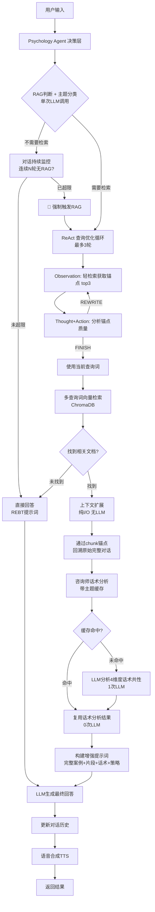
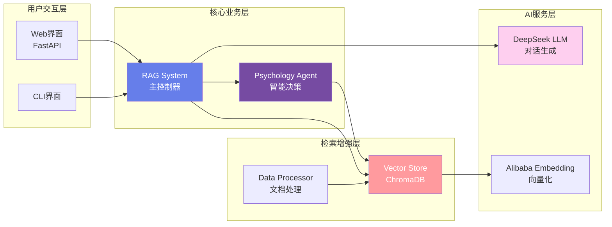

# 心理咨询伴侣 - 系统架构

## 项目类型
**RAG-Augmented Conversational Agent** (RAG增强型对话智能体)

## 核心Pipeline流程图

## 系统架构层次

## 技术栈
- **LLM**: DeepSeek Chat
- **Embedding**: Alibaba Text-Embedding-v4
- **Vector DB**: ChromaDB
- **Web框架**: FastAPI
- **AI理论**: 理情行为疗法 (REBT)

